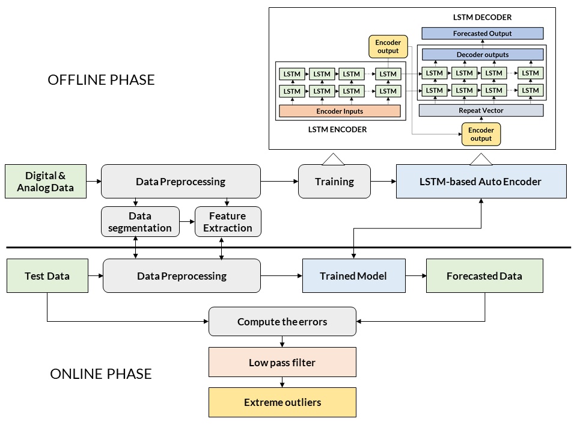
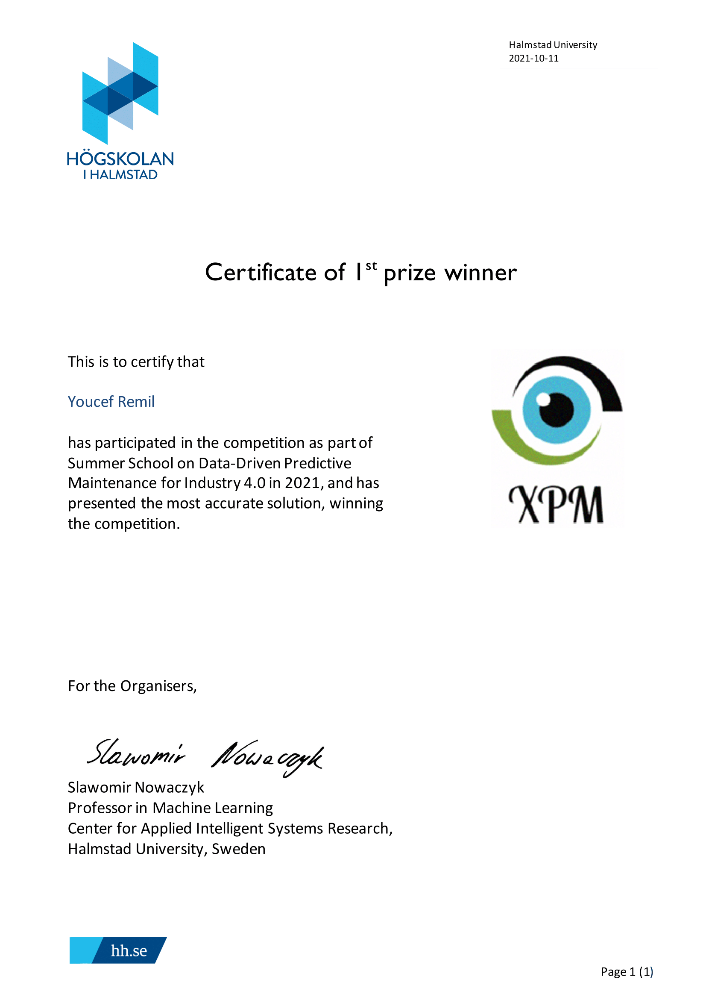

# DSAA (International Conference on Data Science and Advanced Analytics, Core A) Summer School Competition

## Problem
The objective is to predict early failures in the air production unit system (APU) by identifying abnormal behaviors in the data stream obtained from a set of sensors installed in the system while the metro is in operation using unsupervised methods based on deep learning. These failures are typically undetectable using conventional rule-based alert methods (predefined thresholds). The signal acquisition system on the APU collects analog data from eight sensors (pressure, temperature, consumed electrical current, etc.), as well as categorical data that assume two values of 0 and 1 indicating whether a specific component in the system is inactive, or when an event activates it.

## Proposed Solution
I have developed an unsupervised deep learning method that involves an LSTM auto-encoder capable of capturing the normal behavior of the different data streams from various sensors in the system at a frequency of 1Hz. Subsequently, a low-pass filter was used to identify extreme outliers with respect to residual distributions, i.e., the difference between actual values and values predicted by the model. An effective data preprocessing phase was also proposed to provide a data model containing only useful information for prediction. The proposed solution achieved the best results, enabling us to win the competition.

## Winning Certificate

